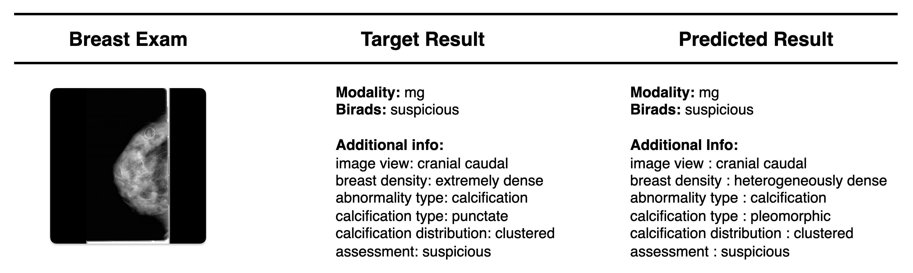

# Unified Multimodal Breast Cancer Imaging: A Novel Dataset and SVLM Framework for Enhanced Diagnosis

Breast multimodal models &ndash; trained on Digital Mammography (MG), Magnetic Ressonance Image (MRI), and Ultrasound (US) &ndash; are able to compete agressively with unimodal models while maintaining complexity (in both size and architecture).
This pomotes a shift in research towards the multimodality, removing the need for multiple unimodal models, and promoting a correlation between exams that women usually perform.

The scope of this work focuses on Small Vision-Language Models (SVLM) to attend to medical restrictions such as: reduced budget and less advanced infrastructure; ownership of the models instead of relying on cloud solutions and therefore promoting data privacy; and interpretability of the model predictions to understand the rationale behind the diagnosis.

The base-sized models use 176M parameters (with DINOv2 pre-trained on ImageNet as image encoder), and are trained on semi-structured reports in a "column:value" format with:
- Adjusted DINOv2 patch representations;
- Ordered conditional auto-regressive semi-structured generation.

## Sample



## Results
Base model results. All scored 100% on modality identification.

| **Eval**                                           | **MRI Test Set** | **US Test Set** | **MG Test Set** |
| -------------------------------------------------- | ---------------- | --------------- | --------------- |
| **# Exams**                                        | 3497             | 61              | 5568            |
| **# BI-RADS Cases**                                | 4                | 7               | 10              |
| **Respective Unimodal Model**                      |                  |                 |                 |
| &nbsp; &nbsp; &nbsp; BI-RADS F1-Score (%)          | **43.13**        | 3.88            | **27.35**       |
| &nbsp; &nbsp; &nbsp; Additional Information BLEU-4 | 0.6815           | 0.5177          | **0.7042**      |
| **Multimodal Model**                               |                  |                 |                 |
| &nbsp; &nbsp; &nbsp; BI-RADS F1-Score (%)          | 27.86            | **60.15**       | 27.02           |
| &nbsp; &nbsp; &nbsp; Additional Information BLEU-4 | **0.8180**       | **0.8121**      | 0.6766          |


  

## Setup
**NOTE: For this project, WandB is used as experiment tracker. It would be beneficial to have it setup as well.**

Create the environment:
```shell
make conda_environment
```

Activate it:
```shell
conda activate breast-mm-svlm
```

And install the needed requirements:
```shell
make requirements
```

## Data Preparation
### Data Collection
Download the used datasets using the links below. 

| Dataset Name                | Link                                                                               |
| --------------------------- | ---------------------------------------------------------------------------------- |
| Advanced-MRI-Lesions        | https://www.cancerimagingarchive.net/collection/advanced-mri-breast-lesions/       |
| Breast Micro-Calcifications | https://zenodo.org/records/7969411                                                 |
| Breast USG-Lesions          | https://www.cancerimagingarchive.net/collection/breast-lesions-usg/                |
| BUSI                        | https://www.kaggle.com/datasets/aryashah2k/breast-ultrasound-images-dataset        |
| CMMD                        | https://www.cancerimagingarchive.net/collection/cmmd/                              |
| CBIS-DDSM                   | https://www.kaggle.com/datasets/awsaf49/cbis-ddsm-breast-cancer-image-dataset/data |
| CDD-CESM                    | https://www.cancerimagingarchive.net/collection/cdd-cesm/                          |
| DUKE-BC-MRI                 | https://www.cancerimagingarchive.net/collection/duke-breast-cancer-mri/            |
| EMBED                       | https://registry.opendata.aws/emory-breast-imaging-dataset-embed/                  |
| RSNA BCD                    | https://www.kaggle.com/competitions/rsna-breast-cancer-detection/data              |

### Data Organization
⚠️ **IMPORTANT** ⚠️ 
- The downloaded data should be stored in a "data/raw" folder, outside of this repo, separated by dataset folder.
- Any changes in the folder names, any paths, etc, will cause the automatic pre-processing to break. If it does so, please check the paths referenced in the ```data_preprocessing/``` configs.
- Here's the example the way we stored it:
```txt
raw/
├── advanced-mri-breast-lesions
│   ├── Advanced-MRI-Breast-Lesions
│   ├── Advanced-MRI-Breast-Lesions-DA-Clinical-Jan112024.xlsx
│   └── metadata.csv
├── breast-lesions-usg
│   ├── BrEaST-Lesions-USG-clinical-data-Dec-15-2023.xlsx
│   └── BrEaST-Lesions_USG-images_and_masks
├── breast-micro-calc
│   ├── Description.xlsx
│   ├── README_v2.txt
│   └── imgs
├── busi
│   ├── benign
│   ├── dataset_comment_list.csv
│   ├── malignant
│   └── normal
├── cbis-ddsm
│   ├── calc_case_description_test_set.csv
│   ├── calc_case_description_train_set.csv
│   ├── dicom_info.csv
│   ├── jpeg
│   ├── mass_case_description_test_set.csv
│   ├── mass_case_description_train_set.csv
│   └── meta.csv
├── cdd-cesm
│   ├── Medical reports for cases
│   ├── Radiology-manual-annotations.xlsx
│   ├── Radiology_hand_drawn_segmentations_v2.csv
│   └── imgs
├── cmmd
│   ├── CMMD_clinicaldata_revision.xlsx
│   ├── imgs
│   └── metadata.csv
├── duke-breast-cancer-mri
│   ├── Annotation_Boxes.xlsx
│   ├── Breast-Cancer-MRI-filepath_filename-mapping.xlsx
│   ├── Breast_Radiologist_Density_Assessments.xlsx
│   ├── Clinical_and_Other_Features.xlsx
│   ├── Imaging_Features.xlsx
│   ├── PKG - Duke-Breast-Cancer-MRI-Supplement-V2
│   ├── PKG - Duke-Breast-Cancer-MRI-Supplement-v3
│   ├── duke_README.txt
│   ├── imgs
│   ├── manifest-1654811613950
│   ├── segmentation_filepath_mapping.csv
│   ├── test_ids.csv
│   └── train_ids.csv
├── embed
│   ├── AWS_Open_Data_Clinical_Legend.csv
│   ├── EMBED_OpenData_clinical.csv
│   ├── EMBED_OpenData_clinical_reduced.csv
│   ├── EMBED_OpenData_metadata.csv
│   ├── EMBED_OpenData_metadata_reduced.csv
│   ├── image_sizes.csv
│   └── imgs
└── rsna-bcd
    ├── sample_submission.csv
    ├── test.csv
    ├── test_images
    ├── train.csv
    └── train_images

```
### Data Processing
Process all datasets with:
```shell
make processed-datasets
```

And then split them with:
```shell
make report-generation-dataset
```

## Training
To train all the base models for each modality, run:
```shell
make rg-dino-decoder
```

**NOTE:** If you want to train a different version of the models, please uncomment the desired models in the makefile and run the command above. The available models are stated below.


| Model  | Size (Millions of Parameters) | Nº Layers | Nº Heads per Layer | Context Length | FF dimension | Image-Text Projection Scale | Image Encoder            |
| ------ | ----------------------------- | --------- | ------------------ | -------------- | ------------ | --------------------------- | ------------------------ |
| Base   | 176                           | 6         | 6                  | 1024           | 3072 (768*4) | 8                           | DINOv2 ViT-B/14 with Reg |
| Base-S | 106                           | 6         | 6                  | 1024           | 3072 (768*4) | 8                           | DINOv2 ViT-S/14 with Reg |
| Nano   | 106                           | 2         | 2                  | 512            | 768          | 2                           | DINOv2 ViT-B/14 with Reg |
| Nano-S | 58.6                          | 2         | 2                  | 512            | 768          | 2                           | DINOv2 ViT-S/14 with Reg |


## Evaluation
By default, all runs are being logged to WandB. This way, please grab the models ids respective to each model, and update the configurations at ```configs/report_generation/dino_decoder/eval```.

Once those are updated, please run:
```shell
make evaluate-dino-decoder
```

This will generate a run in WandB that plots some exams, the ground truth report and the predicted report, and also several tables regarding models performance on different metrics, as well as, statistical tests performed.