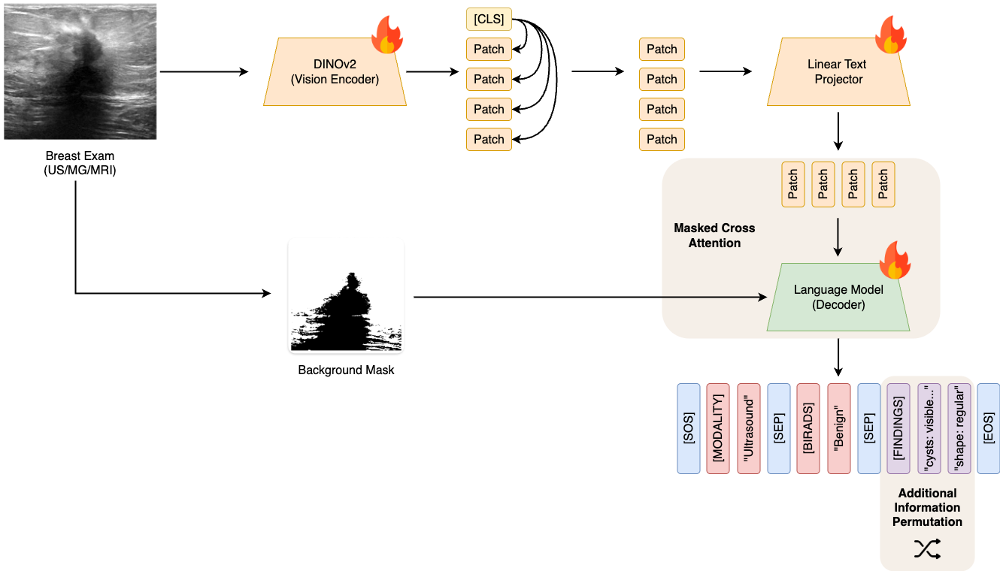
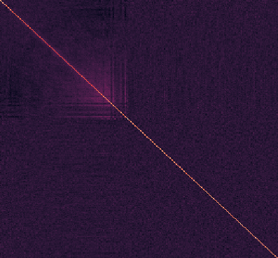
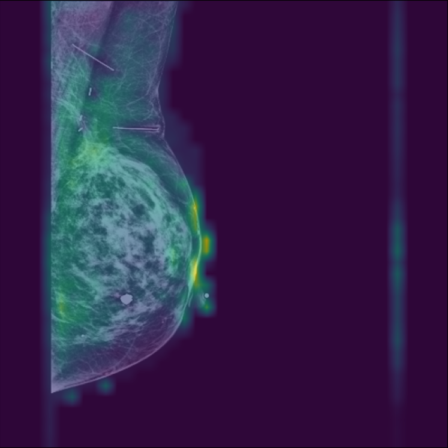

# Unified Multimodal Breast Cancer Imaging: A Novel Dataset and SVLM Framework for Enhanced Diagnosis

This work introduces the first open-source, multimodal breast imaging dataset combining digital mammography (MG), contrast-enhanced spectral mammography (CESM), magnetic resonance imaging (MRI), and ultrasound (US) into a single resource. The dataset aims to address the limitations of current research in integrating these modalities for breast cancer diagnosis, particularly in resource-constrained environments. 

The proposed **Small Vision Small Language Model (SV-SLM)** leverages DINOv2 as its image encoder and a lightweight language decoder to generate clinically relevant diagnostic reports from breast imaging. By using a semi-structured text format ("column:value") instead of structured tabular data, the model achieves a balance in terms of interpretability and avoids complex language learning.

The SV-SLM achieves competitive performance with single-modality models on diagnostic accuracy while maintaining parameter efficiency, making it suitable for clinical deployment.

## Model Architecture
The model architecture is presented on the image below, alongside the plots of the positional embeddings correlation matrix and the attention map when inferring the BI-RADS state on an MG sample. The attention map is computed as the average attention across layers and heads of the cross-attention layers.



Positional Embeddings Correlation Matrix             |  Model Attention On BI-RADS Prediction
:-------------------------:|:-------------------------:
 |  


## Sample


## Setup
**NOTE: For this project, WandB is used as experiment tracker. It would be beneficial to have it setup as well.**

Create the environment:
```shell
make conda_environment
```

Activate it:
```shell
conda activate breast-mm-svlm
```

And install the needed requirements:
```shell
make requirements
```

## Data Preparation
### Data Collection
Download the used datasets using the links below. 

| Dataset Name                | Link                                                                               |
| --------------------------- | ---------------------------------------------------------------------------------- |
| Advanced-MRI-Lesions        | https://www.cancerimagingarchive.net/collection/advanced-mri-breast-lesions/       |
| Breast Micro-Calcifications | https://zenodo.org/records/7969411                                                 |
| Breast USG-Lesions          | https://www.cancerimagingarchive.net/collection/breast-lesions-usg/                |
| BUSI                        | https://www.kaggle.com/datasets/aryashah2k/breast-ultrasound-images-dataset        |
| CMMD                        | https://www.cancerimagingarchive.net/collection/cmmd/                              |
| CBIS-DDSM                   | https://www.kaggle.com/datasets/awsaf49/cbis-ddsm-breast-cancer-image-dataset/data |
| CDD-CESM                    | https://www.cancerimagingarchive.net/collection/cdd-cesm/                          |
| DUKE-BC-MRI                 | https://www.cancerimagingarchive.net/collection/duke-breast-cancer-mri/            |
| EMBED                       | https://registry.opendata.aws/emory-breast-imaging-dataset-embed/                  |
| RSNA BCD                    | https://www.kaggle.com/competitions/rsna-breast-cancer-detection/data              |

### Data Organization
⚠️ **IMPORTANT** ⚠️ 
- The downloaded data should be stored in a "data/raw" folder, outside of this repo, separated by dataset folder.
- Any changes in the folder names, any paths, etc, will cause the automatic pre-processing to break. If it does so, please check the paths referenced in the ```data_preprocessing/``` configs.
- Here's the example the way we stored it:
```txt
raw/
├── advanced-mri-breast-lesions
│   ├── Advanced-MRI-Breast-Lesions
│   ├── Advanced-MRI-Breast-Lesions-DA-Clinical-Jan112024.xlsx
│   └── metadata.csv
├── breast-lesions-usg
│   ├── BrEaST-Lesions-USG-clinical-data-Dec-15-2023.xlsx
│   └── BrEaST-Lesions_USG-images_and_masks
├── breast-micro-calc
│   ├── Description.xlsx
│   ├── README_v2.txt
│   └── imgs
├── busi
│   ├── benign
│   ├── dataset_comment_list.csv
│   ├── malignant
│   └── normal
├── cbis-ddsm
│   ├── calc_case_description_test_set.csv
│   ├── calc_case_description_train_set.csv
│   ├── dicom_info.csv
│   ├── jpeg
│   ├── mass_case_description_test_set.csv
│   ├── mass_case_description_train_set.csv
│   └── meta.csv
├── cdd-cesm
│   ├── Medical reports for cases
│   ├── Radiology-manual-annotations.xlsx
│   ├── Radiology_hand_drawn_segmentations_v2.csv
│   └── imgs
├── cmmd
│   ├── CMMD_clinicaldata_revision.xlsx
│   ├── imgs
│   └── metadata.csv
├── duke-breast-cancer-mri
│   ├── Annotation_Boxes.xlsx
│   ├── Breast-Cancer-MRI-filepath_filename-mapping.xlsx
│   ├── Breast_Radiologist_Density_Assessments.xlsx
│   ├── Clinical_and_Other_Features.xlsx
│   ├── Imaging_Features.xlsx
│   ├── PKG - Duke-Breast-Cancer-MRI-Supplement-V2
│   ├── PKG - Duke-Breast-Cancer-MRI-Supplement-v3
│   ├── duke_README.txt
│   ├── imgs
│   ├── manifest-1654811613950
│   ├── segmentation_filepath_mapping.csv
│   ├── test_ids.csv
│   └── train_ids.csv
├── embed
│   ├── AWS_Open_Data_Clinical_Legend.csv
│   ├── EMBED_OpenData_clinical.csv
│   ├── EMBED_OpenData_clinical_reduced.csv
│   ├── EMBED_OpenData_metadata.csv
│   ├── EMBED_OpenData_metadata_reduced.csv
│   ├── image_sizes.csv
│   └── imgs
└── rsna-bcd
    ├── sample_submission.csv
    ├── test.csv
    ├── test_images
    ├── train.csv
    └── train_images

```
### Data Processing
Process all datasets with:
```shell
make processed-datasets
```

And then split them with:
```shell
make report-generation-dataset
```

## Training
To train all the base models for each modality, run:
```shell
make rg-dino-decoder
```

**NOTE:** If you want to train a different version of the models, please uncomment the desired models in the makefile and run the command above. The available models are stated below, alongside metrics of their computed evaluation alone.


| **Model** | **Params (M)** | **Modality F1-Score US** | **Modality F1-Score MR** | **Modality F1-Score MG** | **BI-RADS F1-Score US** | **BI-RADS F1-Score MR** | **BI-RADS F1-Score MG** | **Findings BLEU-4 US** | **Findings BLEU-4 MR** | **Findings BLEU-4 MG** | **Findings METEOR US** | **Findings METEOR MR** | **Findings METEOR MG** | **Findings Coverage US** | **Findings Coverage MR** | **Findings Coverage MG** | **Findings Equalities US** | **Findings Equalities MR** | **Findings Equalities MG** |
| :-------: | :------------: | :----------------------: | :----------------------: | :----------------------: | :---------------------: | :---------------------: | :---------------------: | :--------------------: | :--------------------: | :--------------------: | :--------------------: | :--------------------: | :--------------------: | :----------------------: | :----------------------: | :----------------------: | :------------------------: | :------------------------: | :------------------------: |
|  Small-S  |      58.6      |           1.00           |           1.00           |           0.50           |           0.18          |           0.19          |           0.10          |          0.42          |          0.51          |          0.41          |          0.49          |          0.64          |          0.47          |           0.66           |           0.74           |           0.76           |            0.61            |            0.93            |            0.32            |
|  Small-B  |      106.0     |           1.00           |           1.00           |           0.50           |           0.28          |           0.30          |           0.08          |          0.52          |          0.60          |          0.37          |          0.60          |          0.74          |          0.44          |           0.82           |         **0.87**         |           0.75           |            0.54            |            0.94            |            0.30            |
|   Base-S  |      106.0     |           1.00           |           1.00           |           0.50           |           0.41          |           0.34          |           0.14          |          0.55          |        **0.63**        |          0.51          |          0.58          |          0.74          |          0.53          |           0.84           |           0.84           |         **0.84**         |            0.60            |          **0.94**          |            0.38            |
|   Base-B  |      176.0     |         **1.00**         |         **1.00**         |         **1.00**         |         **0.44**        |         **0.51**        |         **0.15**        |        **0.60**        |          0.60          |        **0.52**        |        **0.62**        |        **0.74**        |        **0.55**        |         **0.90**         |           0.86           |           0.82           |          **0.64**          |            0.93            |          **0.41**          |

*Bold values indicate the best performance in each column.*


## Evaluation
By default, all runs are being logged to WandB. This way, please grab the models ids respective to each model, and update the configurations at ```configs/report_generation/dino_decoder/eval```.

Once those are updated, please run:
```shell
make evaluate-dino-decoder
```

This will generate a run in WandB that plots some exams, the ground truth report and the predicted report, and also several tables regarding models performance on different metrics, as well as, statistical tests performed.

Below are the evaluation results of the Base-S model.

**Statistical Significance (Wilcoxon Test):** n.s. = No Significance; \* = *p* < 0.05; \*\* = *p* < 0.01; \*\*\* = *p* < 0.001; \*\*\*\* = *p* < 0.0001

| **Metric**                      | **MRI Set**<br>Unimodal |  **MRI Set**<br>Multimodal  | **US Set**<br>Unimodal |   **US Set**<br>Multimodal  |    **MG Set**<br>Unimodal   | **MG Set**<br>Multimodal |
| ------------------------------- | :---------------------: | :-------------------------: | :--------------------: | :-------------------------: | :-------------------------: | :----------------------: |
| **# Exams**                     |    3497    |           3497           |    61   |            61            |   5568  |        5568                  |
| **# BI-RADS Cases**             |    4    |             4            |   7   |             7            |    10   |           10               |
| **Modality F1-Score**           |           0.49          |           **1.00**          |          1.00          |           **1.00**          |             0.50            |           0.50           |
| **BI-RADS F1-Score**            |           0.13          | **0.34<sup>\*\*\*\*</sup>** |          0.04          |  **0.41<sup>**\*</sup>\*\*  | **0.16<sup>\*\*\*\*</sup>** |           0.14           |
| **Findings BLEU-4**             |           0.56          | **0.63<sup>\*\*\*\*</sup>** |          0.25          | **0.55<sup>\*\*\*\*</sup>** | **0.54<sup>\*\*\*\*</sup>** |           0.51           |
| **Findings METEOR**             |           0.70          |           **0.74**          |          0.41          |           **0.58**          |           **0.60**          |           0.53           |
| **Findings Coverage**           |           0.80          |           **0.84**          |          0.49          |           **0.84**          |           **0.85**          |           0.84           |
| **Covered Findings Equalities** |           0.88          |           **0.94**          |          0.12          |           **0.60**          |           **0.43**          |           0.38           |
